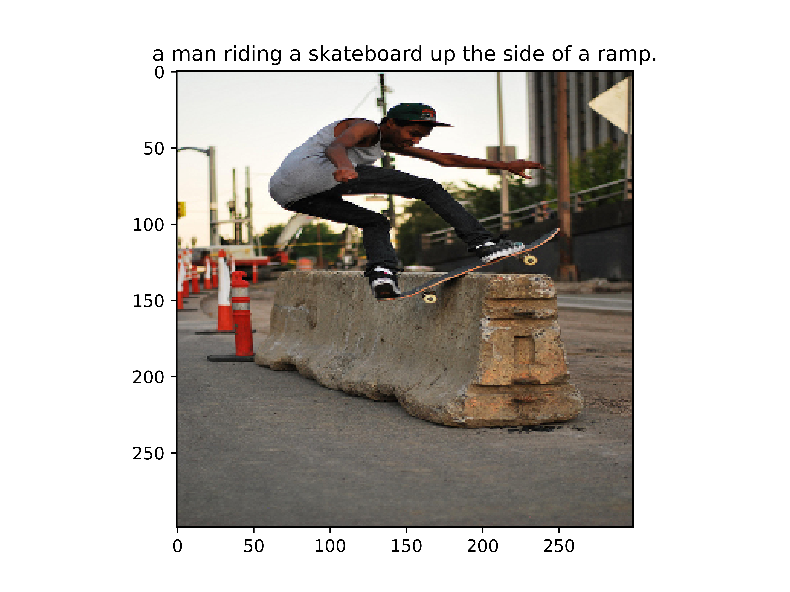
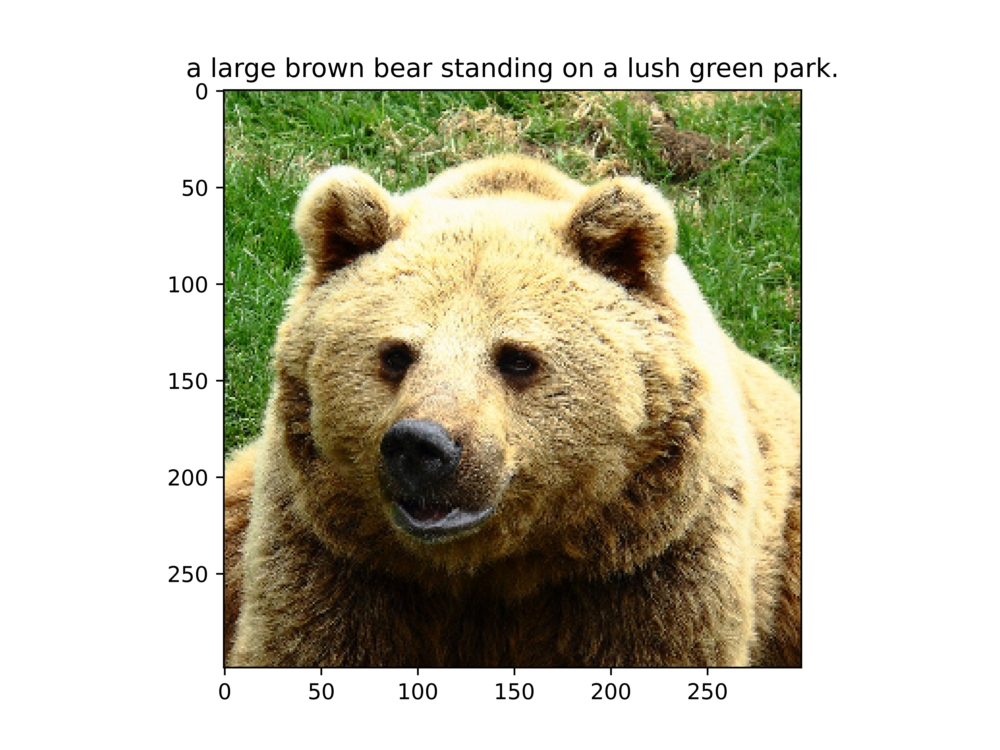
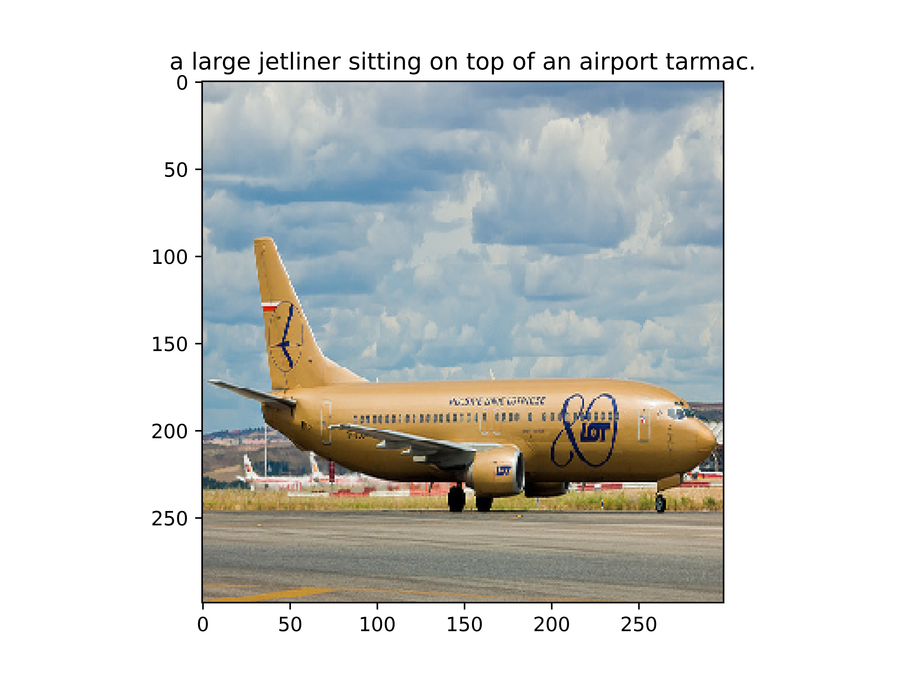
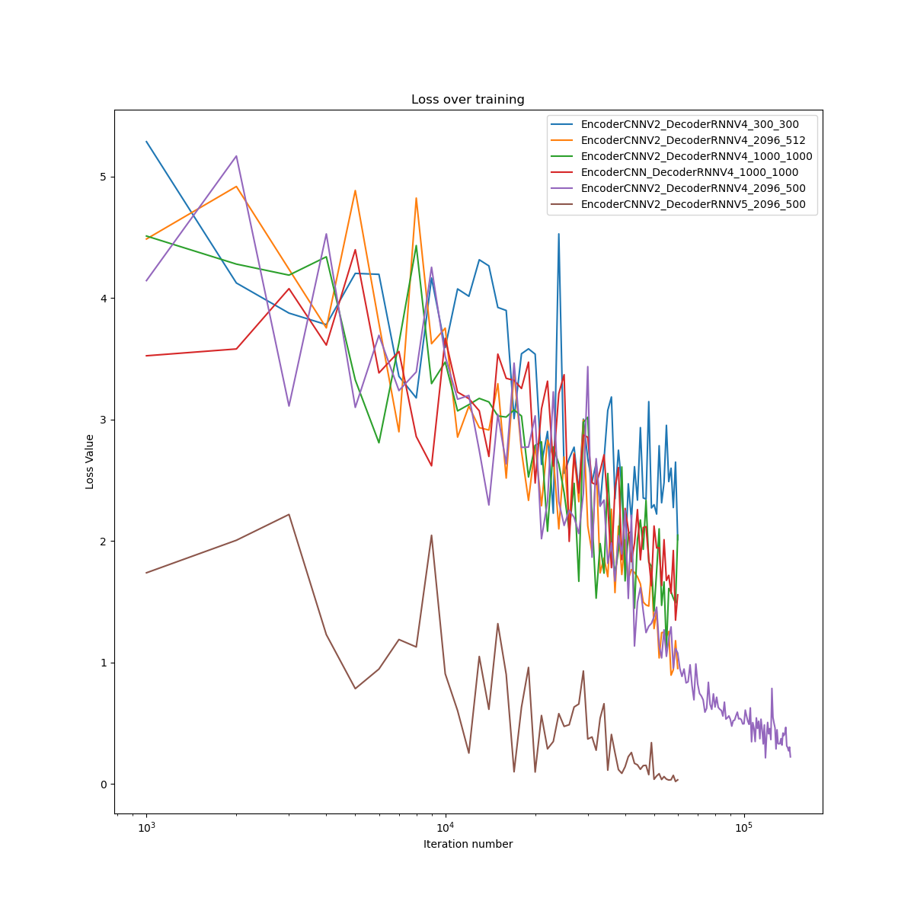

# Deep-learning-image-caption

## Objective
 Building a model that can generate a description of an image automatically

### Examples




## Overview
The input to our model is a single image, while the output is a sentence that describes the input image. 

The encoding stage of our models "translates" an image to features in a latent vector space with a higher dimension than the original image vector. 
Decoding refers to generating a well-formed sentence from a vector in the latent space.

In the encoding part, we used deep CNN to represent the input image as vectors of features which reflects the different objects presented in the image. 

In the decoding part, these features vectors were fed into a deep RNN model to generate a description sentence. 


## Implementation
### Dataset
See [dataset.py](utils/dataset.py) and [vocab.py](utils/vocab.py)

We used MSCOCO 17 dataset using the [train(18GB)](http://images.cocodataset.org/zips/train2017.zip) and [val(1GB)](http://images.cocodataset.org/zips/val2017.zip) along with the [annotation](http://images.cocodataset.org/annotations/annotations_trainval2017.zip) file

since we are using a pre-trained CNN model all image inputs to the model should be transformed according to [PyTorch's standard transformation](https://pytorch.org/vision/stable/models.html): 
```python3
mean = [0.485, 0.456, 0.406]
std = [0.229, 0.224, 0.225]
```
We will also resize all images to 299x299 for uniformity.

### Captions
Captions are both the target and the input of the model during training. 
To generate the first word we created a special symbol- \<SOS> that marks the start of a sentence and also \<EOS> to mark the end of a sentence. 
\<UNK> was used to mark unknown words that are not present in our vocabulary. 

`<SOS> A man riding a horse <EOS>`

Since our model expects all captions to be of the same length we used padding with a special symbol: \<PAD>.
Therefore the sentence above will actually become:

`<SOS> A man riding a horse <EOS> <PAD> <PAD>...`

All of the captions are been transformed into numerical tensors using a special mapping that assigns a unique number to each word.
For the sentence above the actual vector that is fed to the model will be

`[1, 4, 5, 6, 4, 7, 2, 0, 0, 0, ...]`

We track the actual caption length (Without padding) using PyTorch's [pad_packed_sequence](https://pytorch.org/docs/stable/generated/torch.nn.utils.rnn.pad_packed_sequence.html)

## Training

See [train.py](utils/train.py) and [main.py](main.py)

To train the model from scratch simply run 

`python3 main.py [img files directory path] [annotation.json file path] [number of epochs to run] --checkpoint [where to save the model]`

You can also resume training by simply adding `--resume` to the command above

### Loss and Optimizer

We used [CrossEntropyLoss](https://pytorch.org/docs/stable/generated/torch.nn.CrossEntropyLoss.html) and [Adam](https://pytorch.org/docs/stable/optim.html) as our loss function and optimizer.


## Inferance
See [caption.py](caption.py) and [models.py](utils/models.py)

During inferance (prediction) we cannot use the `forward()` function directly since it expects a caption to be supplied.
To generate captions our model uses a new function called `caption_image(img, vocab, max_len)` wich recieves an image tensor, the vocabulary and a maximal caption length to generate and generates a caption accordingly. 

You can also view the captioned image using `show_image()` function under [train.py](utils/train.py)

For a complete demo on any image simply run the following:

```bash
python3 caption.py --img "path/to/image/file"
```
* If you are running the in a terminal (no GUI) add `--no-gui` 

## Validation

see [experiment.py](experiment.py)

You can test and validate various model versions with different hyper parameters using this module. 

The module initializes a model with the given parameters, trains it for the given number of epochs and validates the results using BLEU-N scoring for N=1,2,3,4.

You can also plot the loss and BLEU score table
### Examples



